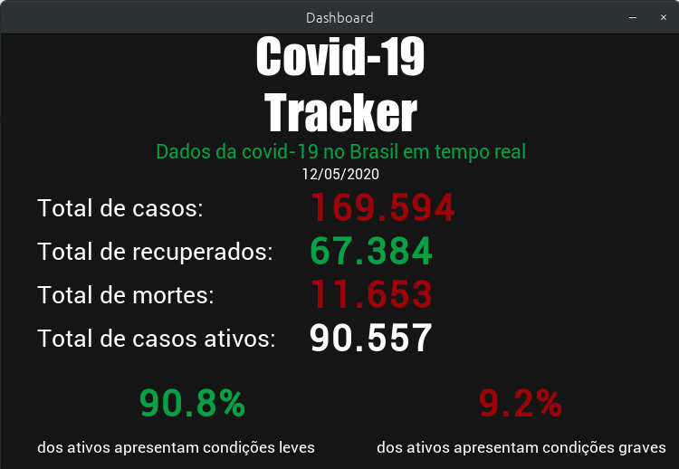

# 🕵️ Covid-19 Brasil Tracker 🕵️
Um programa em python para acompanhar os dados mais recentes do coronavírus no Brasil

:heavy_check_mark: Total de casos  
:heavy_check_mark: Total de recuperados  
:heavy_check_mark: Total de mortes  
:heavy_check_mark: Total de casos ativos e gravidade dos ativos  
:heavy_check_mark: Rodando no Windows  
:heavy_check_mark: Rodando no Linux

---  
  
  
## :heavy_exclamation_mark: Requisitos importantes : :heavy_exclamation_mark:
  
##### 1. Você deve ter o Python 3.x instalado, caso ainda não tenha, [veja este tutorial para Windows](https://realpython.com/installing-python/#windows), ou [este tutorial para Linux](https://realpython.com/installing-python/#linux)!

##### 2. Tenha certeza de clicar em "Adicionar Python 3.x ao PATH" na instalação (Windows)

##### 3. Tenha certeza que o 'pip' está instalado:
- No terminal: `pip` - Alguns comandos e informações devem aparecer

##### 4. Instale o Requests:
- No terminal: `pip install requests` - Espere até completar a instalação

##### 5. Instale o BeautifulSoup4:
- No terminal: `pip install bs4` - Espere até completar a instalação
  
  
## :rocket: Rodando o programa :rocket:
  
#### 1. Clone este repositório ou baixe o ZIP

#### 2. Rode o programa:
- No terminal: `python main.py`
---  

##### Wait... WHAT?

